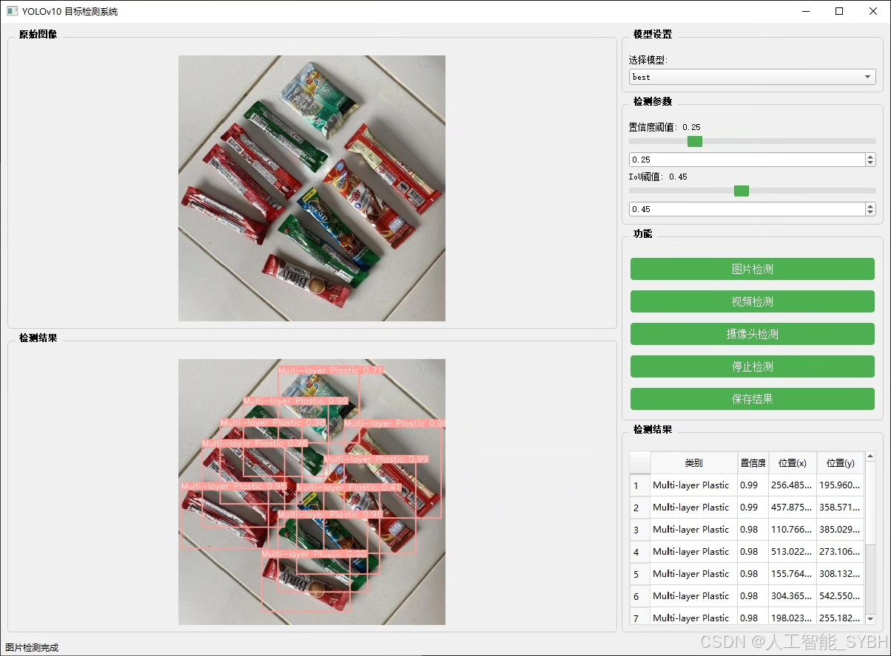
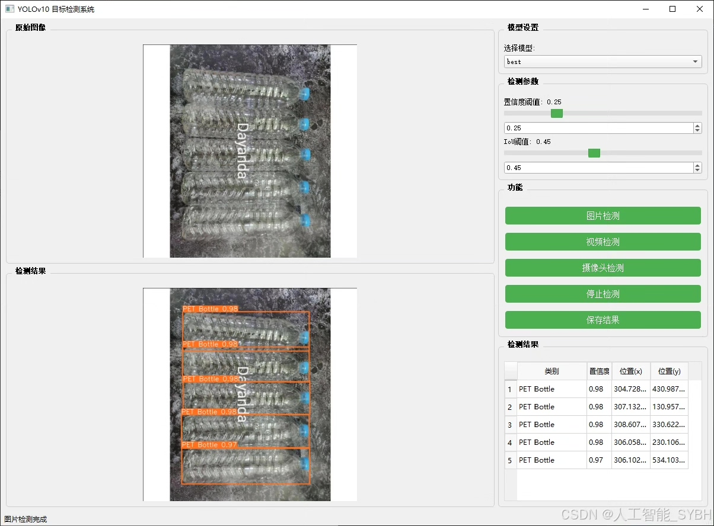
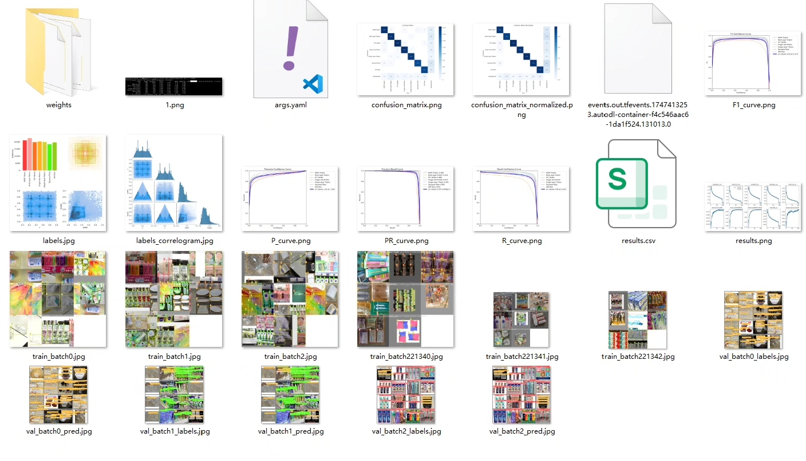
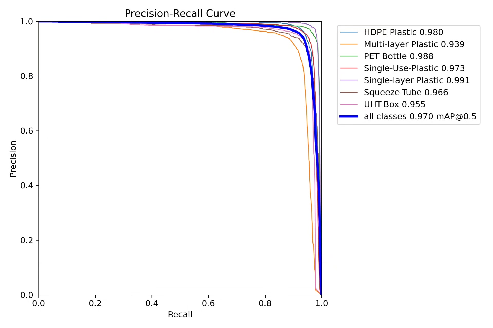
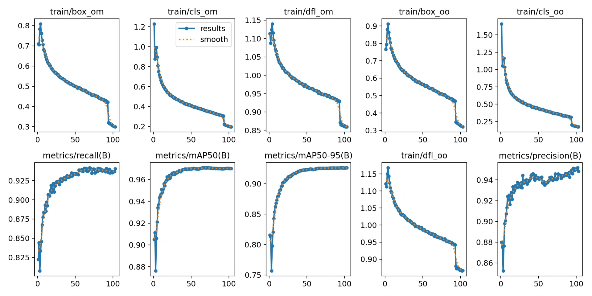
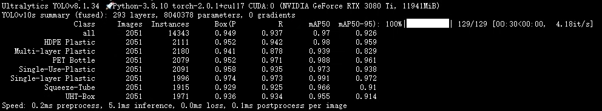
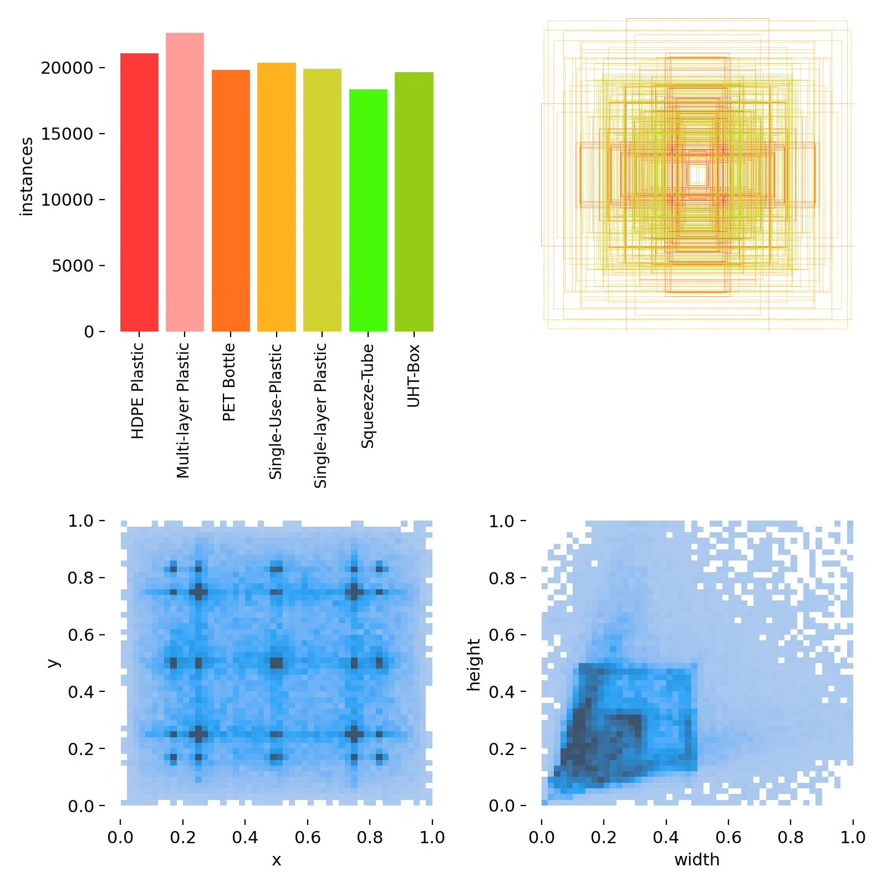
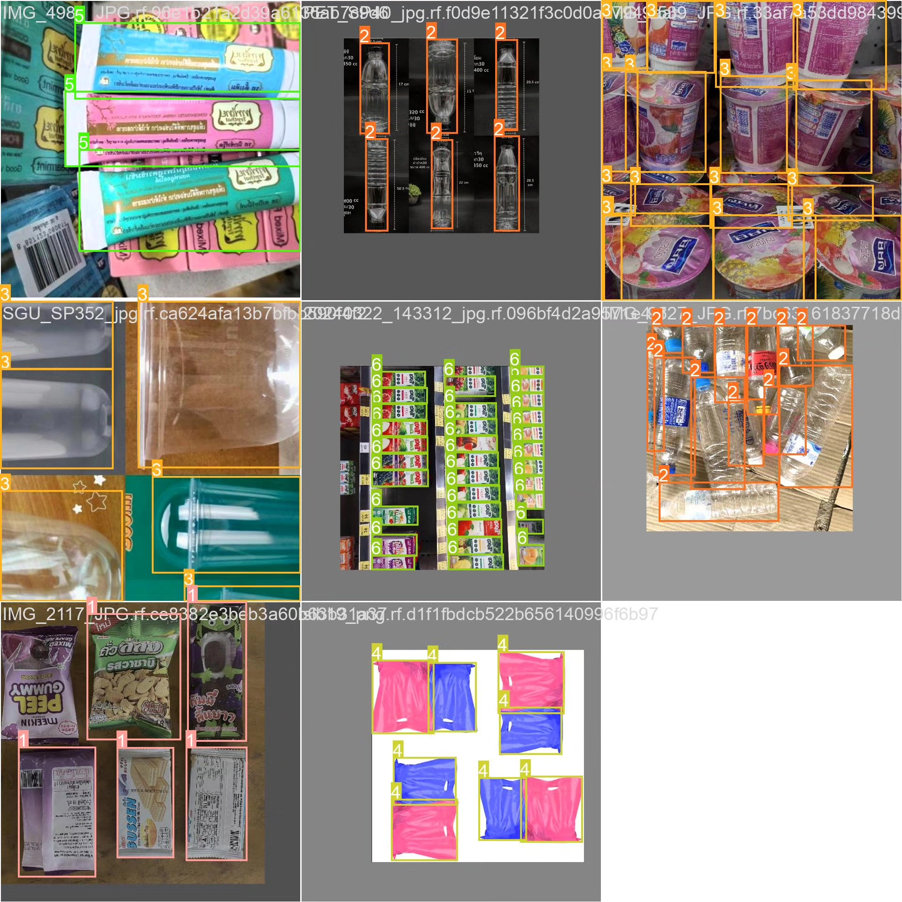

# Recyclable plastic identification and classification detection system based on deep learning YOLOv10 (YO)

## Body

Based on the cutting-edge YOLOv10 object detection algorithm, this project has developed a high-precision recyclable plastic identification and classification system. It is specifically designed for automated waste sorting and recycling processes to detect and classify plastic items. The system accurately recognizes seven common recyclable plastics (HDPE plastic, multilayer plastic, PET bottles, disposable plastics, single-layer plastics, extruded tubes, and UHT boxes) using a professional dataset containing 22,075 images for training and validation. The training set consists of 19,034 images, the validation set includes 2,051 images, and the test set contains 990 images. By optimizing the network structure and training strategy of YOLOv10, this system achieves high accuracy in recognizing and classifying various types of plastic products under complex backgrounds, meeting real-time processing requirements. This system provides core technical support for intelligent waste sorting devices, recycled resource recovery systems, and environmental supervision platforms, demonstrating significant environmental and economic benefits.

The company's products have obtained the official commercial license certification from YOLO.

We offer after-sales service:

After payment, we will provide WeChat ID for instant questions and answers.

Environmental configuration: We will provide an instruction manual for setting up the environment, with WeChat available for Q&A.

Remote installation services: If you need remote configuration, an additional fee of 69 is required.
If the configuration fails, all fees are refunded (excluding special older computers that only refund installation fees).

Retraining datasets: Once the environment is configured, you can train on your own computer.
If you need us to retrain, just pay 69 plus computing power fees (2.5 yuan/hour).

Full after-sales service

## Images

## Payment

Here is a pay link on Stripe ( https://buy.stripe.com/3cs8yP7sY87d0vu9AB ). Please contact me lonlonago@foxmail.com after funding $89, and I will send you a complete data files , thank you!

